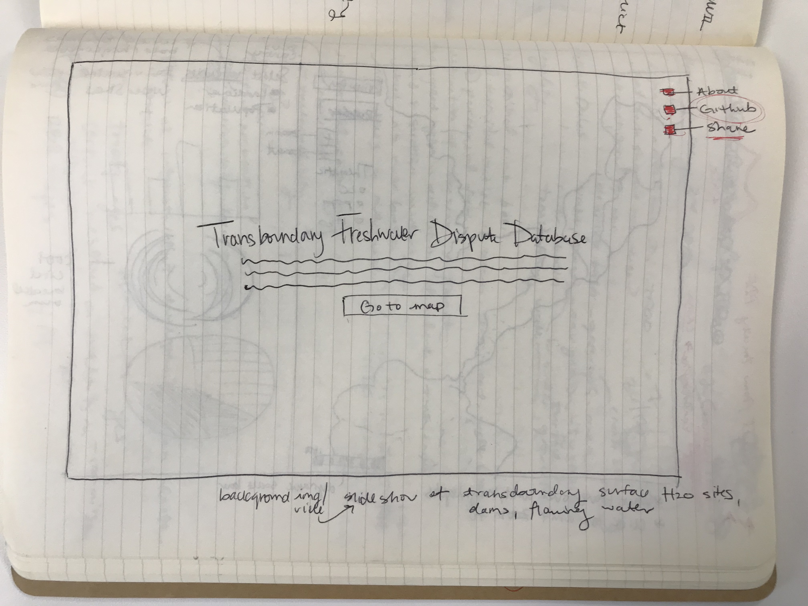
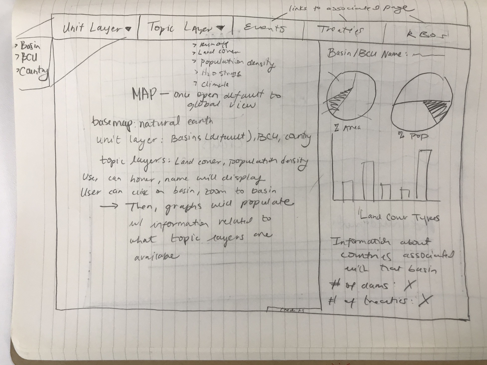
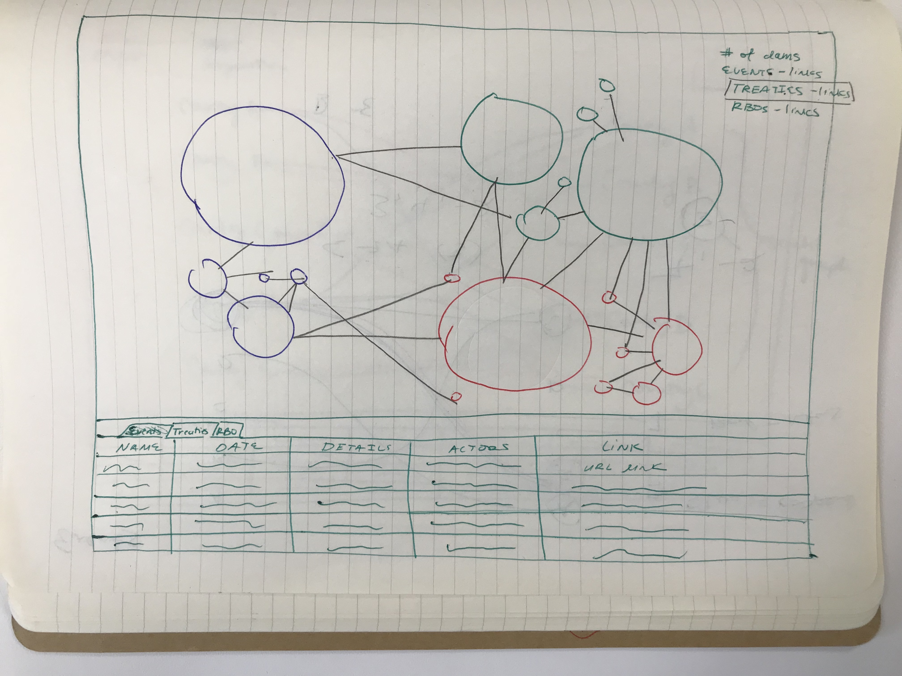
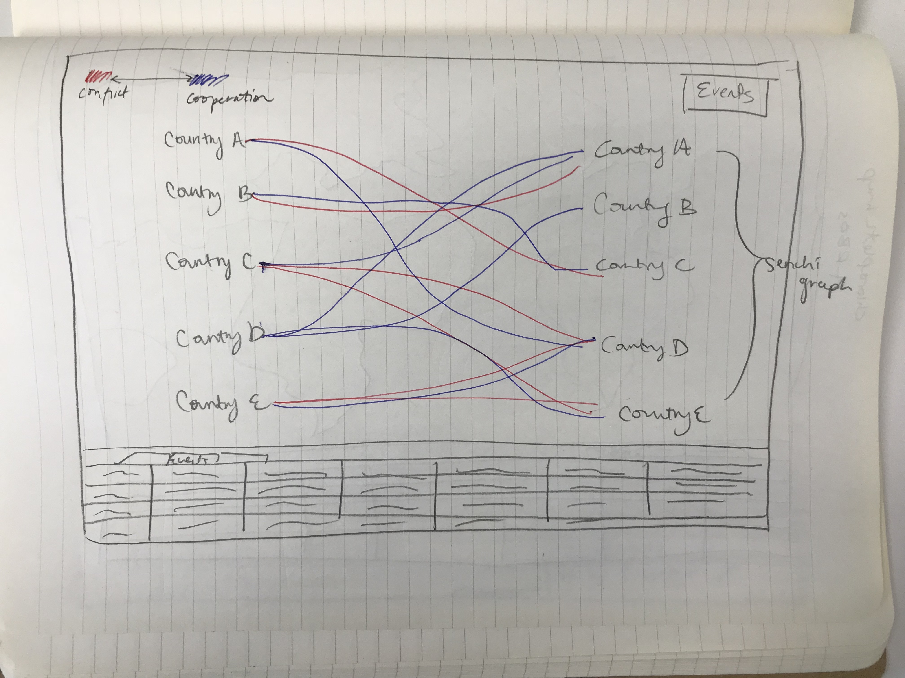
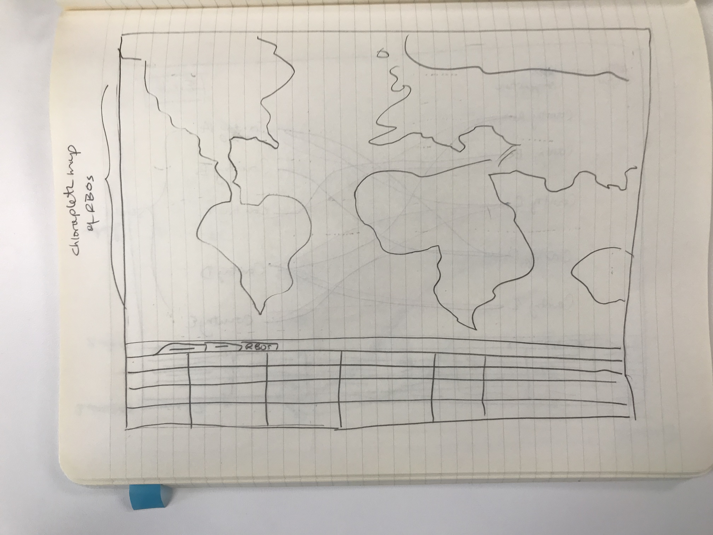
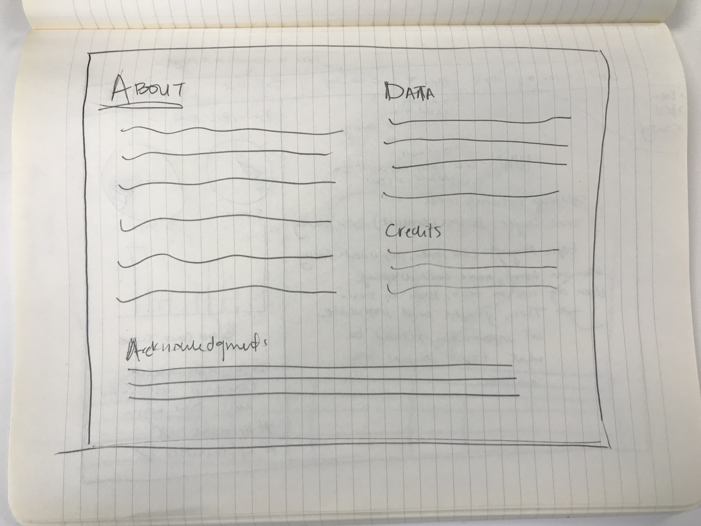
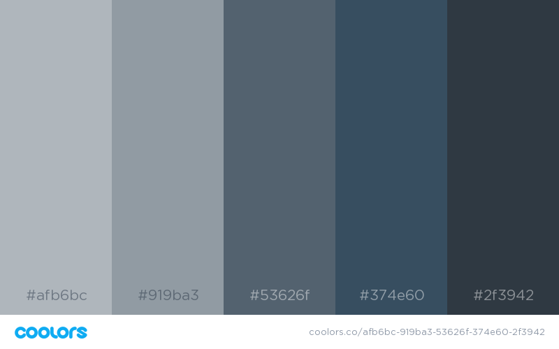
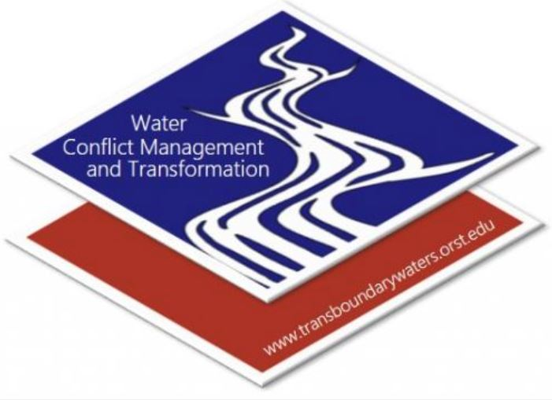

# TFDDGeoViz

## Team Members
Hannah Friedrich, Giovanni Svevo, Alex Walters

## Motives
Create a cleaner, more accessible coordinated, multiple view geovisualization of the Transboundary Freshwater Dispute Database for others to learn about transboundary freshwater characteristics, conflicts, treaties, dams and physical variables like land cover and irrigated areas associated within a basin, basic country unit (BCUs), or country. 

## Brief Description
Utilizing Transboundary Freshwater Dispute Database data, create a geovisualization that is a dynamic, interactive webmap which 
shows basins, BCUs, and countries and a breakdown associated variables with that particular basin, BCU, or country. Primary goal is to express the variables using D3.js on a side panel, which may be expanded to show a comparison of variables between two basins, BCUs, or countries. For the tabluar data (events, RBOs, and treaties), we would like to have a bar beneath the web map that contains rows of the associated event, RBO, or treaties which the user can scroll through. From this table, one can link to PDFs of the treaties which is hosted by the TFDD group. It is also planned to create a network visualization of the events, RBOs, and treaties to show which countries have treaties with other countries. From the main landing page, one will be able to share, view on Github, and have a link to an "About" page which contains background information on the database, a bibliography, and credits. 

## Data 

### Spatial Data:
The TFDD database has both spatial and tabular data. Spatial data consist in a series of shapefiles (which will be transformed in topojson files for this project) delineating the boundaries of International River Basins and of Basin Country Units. The attribute table of those shapefiles contains information about population, population density and land area in each unit. 

### Tabular Data
Tabular data consist of three excel spreadsheet containing information about: 
1) International water treaties
2) International events (both conflictual and friendly) related to water
3) River Basin Organizations within each basin.

[Link] to data.

## Interface Design 
Coordinated (Multiple) View Geoviz similar to the Climate Proxies Finder

[World Cloud][] for visualizing a world cloud of words from treaties to demonstrate the verbage which may express positive or negative connotations regarding various treaties. 

[Link]: https://github.com/hannahfriedrich/TFDDGeoViz/tree/master/assets
[World Cloud]: https://www.jasondavies.com/wordcloud/

## Variables

### Global Level
#### Chloropeth Layers
Poulation  
Landcover  
Dams  

#### Network Visualization
Treaty  
Events  
RBO  

### Basin/BCU level
Countries  
Land area  
Population  
Dams (existing and planned)  
Treaties  
Events   

## Interface Sketch

The website will be accessed from a landing/welcome page with a brief introduction containing basic information about the database and links to social media and other resources.
The main interface of the website will have as a central element a world map with the international water basins and basin country units (BCU, subdivision of each basin among countries) boundaries. Clicking on each basin/BCU a side panel will appear with statistics about that particular unit: population, land area, water, land cover distribution, number of dams etc. The visualization will be in the form of coordinate pie and bar charts.
A navbar on the top of the page will allow to change thematic maps as background: climate world map, land use etc.
From the top navbar you will also be able to switch to the other sections of the website, which take in account international treaties, events and river basin organizations. On these pages the visualization will be in the form of Force Atlas and Sankey diagrams to show the type and number of relationships for each basin/country.

### Landing Page

### Coordinated, Multiple View with Map

### Force Atlas which displays treaties data

### Sankey Diagram which shops conflict, cooperation events

### Choropleth map that shows River Basin Organizations (RBOs)

### About page

## Design Scheme
### 1) Color
Color Scheme URL: https://coolors.co/afb6bc-919ba3-53626f-374e60-2f3942

### 2) Fonts
All fonts will come from Google Fonts:  
Titles: 'Cinzel Decorative'  
Body: 'Artifika'
CDN: <link href="https://fonts.googleapis.com/css?family=Artifika|Cinzel+Decorative" rel="stylesheet">
local: assets/fonts

### 3) Web Icon

TFDD icon for logo and table icon

Events

Dams

Land Cover

Population

Organizations

Icons for menu items
### 4) Multimedia

https://videos.pexels.com/videos/footage-of-nature-waterfalls-857218
